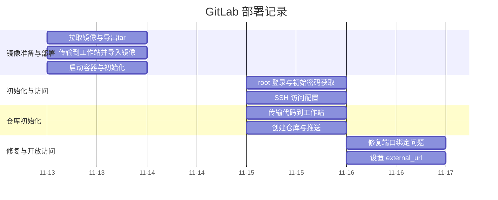

目标：工作站不能连接外网 github，多人在不同本地工作站如何通过 git 同步代码协同开发，通过 gitlab？

```mermaid
gantt
    title GitLab 部署记录
    dateFormat  YYYY-MM-DD
    axisFormat  %m-%d

    section 镜像准备与部署
    拉取镜像与导出tar        :2025-11-13, 1d
    传输到工作站并导入镜像    :2025-11-13, 1d
    启动容器与初始化          :2025-11-13, 1d

    section 初始化与访问
    root 登录与初始密码获取   :2025-11-15, 1d
    SSH 访问配置              :2025-11-15, 1d

    section 仓库初始化
    传输代码到工作站          :2025-11-15, 1d
    创建仓库与推送            :2025-11-15, 1d

    section 修复与开放访问
    修复端口绑定问题          :2025-11-16, 1d
    设置 external_url         :2025-11-16, 1d
```
