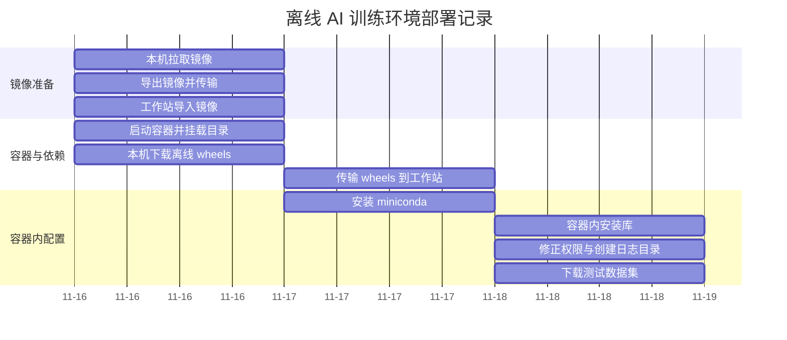

```mermaid
gantt
    title 离线 AI 训练环境部署记录
    dateFormat  YYYY-MM-DD
    axisFormat  %m-%d

    section 镜像准备
    本机拉取镜像              :2025-11-16, 1d
    导出镜像并传输            :2025-11-16, 1d
    工作站导入镜像            :2025-11-16, 1d

    section 容器与依赖
    启动容器并挂载目录        :2025-11-16, 1d
    本机下载离线 wheels       :2025-11-16, 1d
    传输 wheels 到工作站      :2025-11-17, 1d

    section 容器内配置
    安装 miniconda            :2025-11-17, 1d
    容器内安装库              :2025-11-18, 1d
    修正权限与创建日志目录     :2025-11-18, 1d
    下载测试数据集            :2025-11-18, 1d
```
