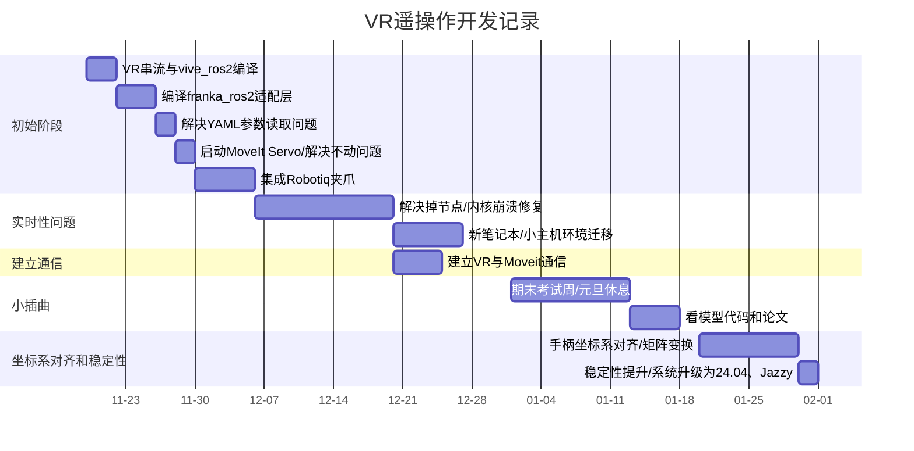

![[遥操开发记录]]

```mermaid
gantt
    title VR遥操作开发记录
    dateFormat  YYYY-MM-DD
    axisFormat  %m-%d
    
    section 初始阶段
    VR串流与vive_ros2编译        :2025-11-19, 3d
    编译franka_ros2适配层        :2025-11-22, 4d
    解决YAML参数读取问题          :2025-11-26, 2d
    启动MoveIt Servo/解决不动问题  :2025-11-28, 2d
    集成Robotiq夹爪              :2025-11-30, 6d
    
    section 实时性问题
    解决掉节点/内核崩溃修复        :2025-12-6, 14d
    新笔记本/小主机环境迁移        :2025-12-20, 7d
    
    section 建立通信
    建立VR与Moveit通信           :2025-12-20, 5d
    
    section 小插曲
    期末考试周/元旦休息           :2026-01-01, 12d
    看模型代码和论文              :2026-01-13, 5d
    
    section 坐标系对齐和稳定性
    手柄坐标系对齐/矩阵变换        :2026-01-20, 10d
    稳定性提升/系统升级为24.04、Jazzy     :2026-01-30, 2d
```
    